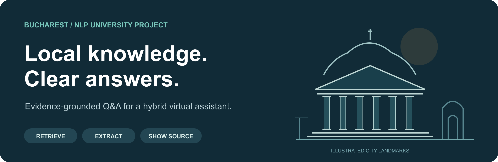
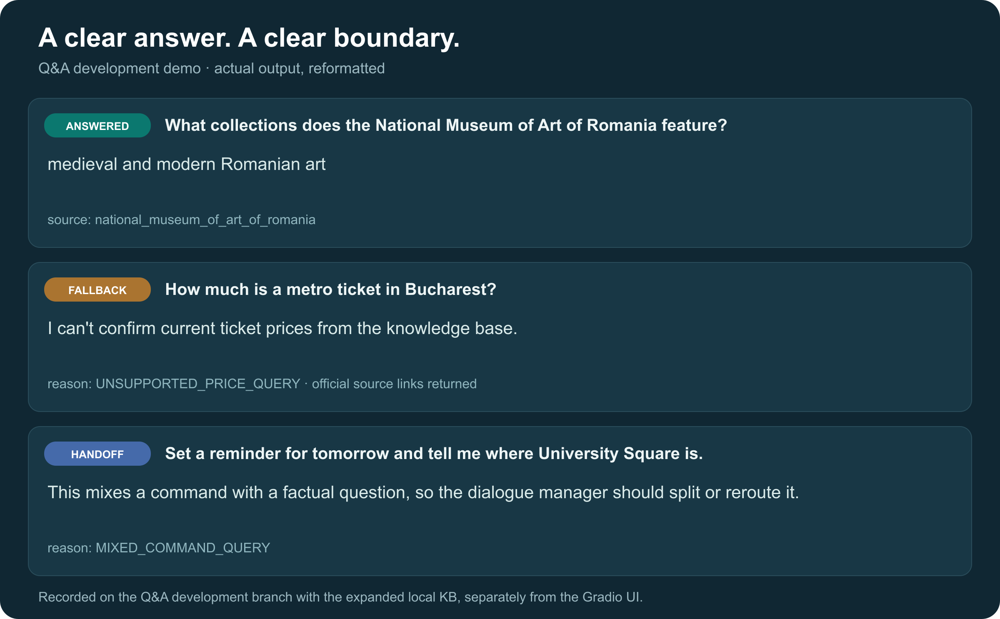
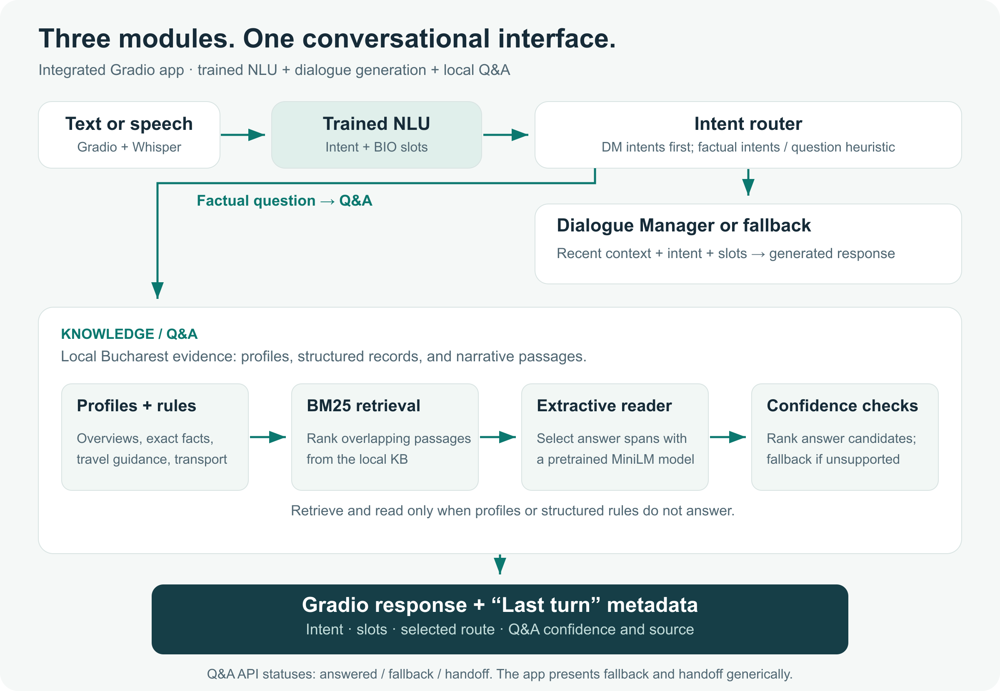
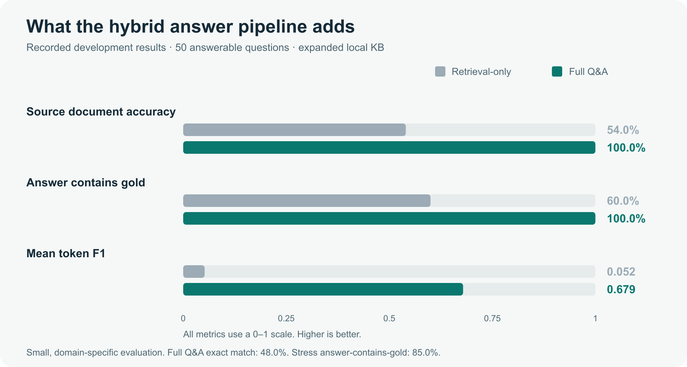

# Hybrid Virtual Assistant

**A Bucharest travel assistant combining intent and slot understanding, dialogue generation, and answers grounded in local evidence.**



`Python 3.11+` · `Gradio` · `PyTorch` · `Transformers` · `BM25` · `Whisper`

[Hosted demo](https://huggingface.co/spaces/roisan13/hybrid-virtual-assistant) · [Examples](#see-it-in-action) · [Architecture](#how-it-works) · [Quick start](#quick-start) · [Results](#evaluation) · [Contributions](#team-and-contributions)

## Overview

Travel questions require different kinds of answers. A landmark overview needs context, a museum address needs precision, and a request for today's ticket price needs current information that a static knowledge base cannot supply.

This university NLP project explores that distinction through a hybrid assistant. The implemented Q&A module combines curated entity profiles, structured local records, BM25 passage retrieval, and a pretrained extractive reader. It returns an answer with source metadata, falls back when evidence is insufficient, or hands a mixed command-and-question request back to the dialogue layer.

The integrated application connects three components through a Gradio chat interface:

| Component | Implementation | Purpose |
| --- | --- | --- |
| Command NLU | Transformer encoder, BiLSTM, and CRF | Classifies intents and extracts slots. |
| Dialogue Manager | Attention-based sequence-to-sequence model | Generates responses from recent dialogue context, intent, and slot values. |
| Knowledge/Q&A | Profiles, structured rules, BM25, and MiniLM | Answers supported Bucharest questions from local evidence. |

The interface shows the predicted intent, extracted slots, selected route, and Q&A confidence/source for each turn. Optional microphone input uses Whisper transcription. Task-oriented responses demonstrate dialogue generation; the app does not execute real bookings or create reminders.

## See it in action



*Q&A development-demo output, reformatted for readability. The [full transcript](assets/readme/demo-transcript.txt) was recorded on the Q&A development branch. The integrated Gradio app routes requests through NLU and presents fallback/handoff results as a generic unavailable-information response.*

| Try asking | What the assistant does |
| --- | --- |
| “What is the Romanian Athenaeum?” | Returns a curated overview with its source document. |
| “What collections does the National Museum of Art of Romania feature?” | Extracts a factual answer from the museum evidence. |
| “Where is the Romanian Athenaeum?” | Uses a structured address record when available. |
| “Show metro as well as STB stations near Romanian Athenaeum” | Uses local place and transit records to report nearby stops and lines. |
| “What season is best to visit Bucharest?” | Returns bounded, curated travel guidance. |
| “How much is a metro ticket in Bucharest?” | Falls back and points to official transport sources. |
| “Set a reminder for tomorrow and tell me where University Square is.” | Returns a handoff so the request can be split or rerouted. |

These examples describe Q&A module behavior. Address and nearby-transport answers require the optional structured records described below. In the app, NLU routing determines whether a question reaches Q&A.

## How it works



Text input, or a Whisper transcription, first passes through the trained NLU model. The router sends task-oriented intents to the Dialogue Manager and factual requests to Q&A; other requests use fallback. NLU intents take priority, with a question heuristic supporting the Q&A route.

The Q&A branch uses three complementary answer paths:

1. **Curated profiles** provide complete landmark overviews and visitor highlights. They address a weakness of extractive readers: a technically correct phrase can still be an unhelpful answer to “Tell me about this place.”
2. **Structured rules** answer precise questions about addresses, nearest metro stations, nearby transport, and travel guidance using normalized records.
3. **BM25 + an extractive reader** handle remaining factual questions. Documents are split into overlapping passages of up to 150 words with a 75-word stride. Retrieved passages are read by `deepset/minilm-uncased-squad2`, and answer candidates pass retrieval and reader confidence checks.

Every response uses the same contract: `answered`, `fallback`, or `handoff`, with a reason code, confidence, and evidence identifiers. The fallback and handoff paths make uncertainty and routing requirements explicit to the calling application.

### Engineering decisions

| Decision | Why it fits this project |
| --- | --- |
| Local, bounded knowledge base | Makes answers inspectable and keeps the assistant focused on Bucharest. |
| Sparse BM25 retrieval | Provides a simple, reproducible baseline for a small corpus. |
| Profiles and structured facts before extraction | Matches the answer method to the question instead of asking one model to handle every case. |
| Extractive answers for narrative factoids | Selects evidence spans rather than generating new factual text. |
| Stable response schema and reason codes | Lets the dialogue layer distinguish an answer, unsupported request, and routing handoff. |
| Development, stress, baseline, and ablation evaluations | Measures answer quality and exposes which parts of the hybrid pipeline contribute. |

## Quick start

Use **Python 3.11 or newer** and [Git LFS](https://git-lfs.com/) for the trained model checkpoints. Run the commands from the repository root. Model/tokenizer downloads require internet access on the first run unless already cached; no paid API key is required.

```bash
# Git LFS must be installed before cloning to retrieve the model weights.
git lfs install
git clone https://github.com/MihneaCucu/Hybrid-Virtual-Assistant.git
cd Hybrid-Virtual-Assistant
git lfs pull

python -m venv .venv
source .venv/bin/activate
python -m pip install -r requirements.txt

# Build Q&A retrieval artifacts from the included narrative evidence.
python scripts/build_index.py

# Start the Gradio chat interface.
python app.py
```

Open the local URL printed by Gradio. On Windows, replace the activation command with `.venv\Scripts\activate`. For microphone input, FFmpeg must also be installed and available on your system path; the Whisper `base` model downloads on first use.

Try **“What is the Romanian Athenaeum?”** or **“Tell me about the Palace of the Parliament.”** The **Last turn** panel exposes intent, slots, routing, and Q&A source metadata. **Clear conversation** resets the dialogue history.

At startup, look for the NLU, Q&A, and Dialogue Manager loaded messages. The pipeline catches module-loading failures and can display stub responses, so a running UI alone does not confirm that every model loaded. If a checkpoint is a small Git LFS pointer instead of the model binary, retrieve the weights with `git lfs pull`.

### Structured place and transport evidence

The integrated branch includes 14 narrative documents, entity profiles, and curated travel guidance. Additional museum, place, and transit JSONL records used in the expanded Q&A experiments are not bundled here.

The [Q&A development branch](https://github.com/MihneaCucu/Hybrid-Virtual-Assistant/tree/mihnea) contains the ingestion/rebuild scripts. To enable these capabilities in the integrated app, generate the structured records with that toolkit, copy its `kb/structured/` records and generated `kb/clean/structured_*.txt` documents into the corresponding application directories, then rebuild the index with `python scripts/build_index.py`. Fetching depends on the external data providers.

After all needed tokenizers and models have been cached, enable offline Hugging Face model loading with `HF_HUB_OFFLINE=1` and `TRANSFORMERS_OFFLINE=1`.

## Use the Q&A module

The public integration surface is [qa/qa_module.py](qa/qa_module.py). Load it once at application startup, then call it for factual information requests.

```python
from qa.qa_module import answer_question, load_qa_system

load_qa_system()
result = answer_question("What does Arcul de Triumf symbolize?")

if result["status"] == "answered":
    print(result["answer"])
    print("Source:", result["source_doc"])
elif result["status"] == "handoff":
    print("Reroute this request:", result["reason_code"])
else:
    print(result["answer"] or "No reliable answer found.")
```

Example response:

```json
{
  "status": "answered",
  "reason_code": null,
  "answer": "Romania's victory in the First World War",
  "source_doc": "arcul_de_triumf",
  "sources": [{"doc_id": "arcul_de_triumf", "chunk_id": "arcul_de_triumf_000"}],
  "confidence": 0.447,
  "fallback": false
}
```

*This example was observed with the expanded local demo index. Confidence scores and selected chunks can vary with the index and model/library versions.*

The schema is defined in [qa/types.py](qa/types.py). Domain keywords and fallback links are configurable in [data/domain_config_bucharest.json](data/domain_config_bucharest.json).

## Evaluation

The following are **recorded local Q&A results** from the expanded demo setup. They measure a small Bucharest-specific test collection, rather than general assistant performance. The [evaluation snapshot](assets/readme/evaluation-snapshot.json) preserves the summary values and their provenance alongside this README.



| Development set: 50 answerable questions | Retrieval-only baseline | Full Q&A |
| --- | ---: | ---: |
| Source document accuracy | 54.0% | **100.0%** |
| Answer contains an accepted gold answer | 60.0% | **100.0%** |
| Mean token F1 | 0.052 | **0.679** |

The full module also achieved **48.0% exact match** on these questions. “Contains gold” allows longer answers that include an accepted reference answer; it should not be read as perfect answer quality. Token F1 measures overlap between answer and reference tokens.

| Additional checks | Recorded result |
| --- | ---: |
| Correct fallback/handoff status on 14 negative or mixed examples | 100.0% |
| Status accuracy on 33 blind/stress examples | 93.9% |
| Answer contains gold on 20 expected-answerable stress examples | 85.0% |
| Source document accuracy on those 20 stress examples | 85.0% |

The baseline returns the top BM25 passage directly. Full Q&A uses the same retriever plus profiles, structured rules, extraction, answer selection, and confidence checks. The comparison therefore measures the complete answer pipeline; the underlying retrieval recall is unchanged.

### Reproduce the Q&A experiments

The evaluation, ablation, test, and CLI-demo toolkit is maintained on the [Q&A development branch](https://github.com/MihneaCucu/Hybrid-Virtual-Assistant/tree/mihnea), separately from this integrated application. Use a separate checkout for these commands:

```bash
git clone --branch mihnea --single-branch \
  https://github.com/MihneaCucu/Hybrid-Virtual-Assistant.git hybrid-qa-dev
cd hybrid-qa-dev
python -m venv .venv
source .venv/bin/activate
python -m pip install -r requirements.txt

# Fetch structured evidence and build the expanded demo KB.
python scripts/rebuild_qa_kb.py --final-demo

python -m pytest -q
python scripts/evaluate_qa.py
python scripts/evaluate_qa_blind.py
python scripts/compare_qa_baselines.py
python scripts/compare_qa_ablation.py
python scripts/hybrid_demo_cli.py --story --show-meta
```

Upstream data and model/library versions can affect results. The integrated branch's narrative-only index does not reproduce every transport/address case or the recorded expanded-index scores. Inspect the development branch's [per-question results](https://github.com/MihneaCucu/Hybrid-Virtual-Assistant/tree/mihnea/results) for detailed error analysis.

## Data and reproducibility

| Evidence | Purpose | Included in a fresh clone? |
| --- | --- | --- |
| 14 cleaned narrative documents | Landmark, museum, city, and metro facts; 41 chunks after indexing | Yes |
| Curated entity profiles | Landmark summaries, history, and visitor highlights | Yes |
| Curated travel guidance | Broad advice about season, budget, and visit duration | Yes |
| Museum and OSM place records | Addresses, descriptions, coordinates, and aliases | Fetch separately |
| TPBI GTFS records and derived metro links | Nearby transport, routes, stops, and nearest stations | Fetch/derive separately |
| BM25 index and chunk file | Runtime retrieval artifacts | Build locally |

The recorded expanded demo index contains **490 chunks across 376 document IDs**, including the 41 narrative chunks. Counts can change when upstream data is fetched again.

The wider project uses **MASSIVE** for intent and slot modelling and **MultiWOZ 2.4** for dialogue modelling. The Q&A runtime evidence comes from the custom Bucharest KB. SQuAD informs the extractive-Q&A approach and overlap metrics; the reader is pretrained on SQuAD 2.0, and SQuAD passages are not used as Bucharest runtime evidence.

See the [data provenance notes](https://github.com/MihneaCucu/Hybrid-Virtual-Assistant/blob/mihnea/docs/qa_data_provenance.md) and [source registry](https://github.com/MihneaCucu/Hybrid-Virtual-Assistant/blob/mihnea/data/kb_sources_bucharest.json) for source details and attribution notes in the Q&A development toolkit.

## Repository guide

```text
app.py                     Gradio chat UI, metadata panel, and microphone input
pipeline.py                Model loading, NLU inference, and request routing
NLU_model.py               Transformer / BiLSTM / CRF joint NLU model
manager.py                 Dialogue history and response-generation interface
model/                     Dialogue model, dataset, training, and evaluation
qa/                        Q&A API, retrieval, reader, routing, and response types
scripts/build_index.py     Narrative and structured-text BM25 index builder
data/                      Q&A profiles/configuration and dialogue data/vocabularies
kb/clean/                  Committed narrative evidence
BiLSTM_model_10epochs/      Primary NLU checkpoint and tokenizer assets
saved_model/               Alternate NLU checkpoint and tokenizer assets
checkpoints/               Dialogue model checkpoint
assets/readme/             Illustrations, demo transcript, and metric snapshot
```

Start with [pipeline.py](pipeline.py) for routing and integration, [qa_module.py](qa/qa_module.py) for the Q&A pipeline, and [manager.py](manager.py) for dialogue state. The development branch's [confidence and fallback notes](https://github.com/MihneaCucu/Hybrid-Virtual-Assistant/blob/mihnea/docs/qa_confidence_and_fallback.md) explain Q&A thresholds and reason codes.

## Team and contributions

This is a collaborative university project. **Mihnea's contribution is the Knowledge/Q&A branch**: the Bucharest evidence pipeline, hybrid answer logic, source-aware response contract, fallback/handoff behavior, evaluation workflow, and Q&A demos.

| Contributor | Project responsibility |
| --- | --- |
| **Mihnea** | Knowledge/Q&A |
| Stefan | Command NLU: intent classification and slot extraction |
| George | Dialogue Manager: dialogue context and response generation |
| Radu | System integration, application, report, and presentation flow |

The wider team's NLU design combines a transformer encoder with BiLSTM slot refinement and CRF decoding. Its dialogue model uses an attention-based encoder–decoder. The integrated app loads both trained components alongside Q&A and shows their routing decisions in the interface.

## Limitations and next steps

- **Bounded, English-first coverage.** The KB focuses on selected Bucharest landmarks and practical travel questions.
- **Static evidence.** Current prices, opening hours, weather, traffic, and booking availability require a live-data integration.
- **Independent questions.** The Q&A module does not resolve conversational references such as “How do I get there?” from earlier turns.
- **Dialogue generation without action execution.** Task-oriented replies do not create reminders, book taxis, or reserve tables.
- **Integration boundaries.** The Q&A API distinguishes fallback and handoff, but the current app displays both as a generic unavailable-information response. NLU routing errors can send a factual question to the dialogue branch.
- **Small local evaluations.** The scores are useful project diagnostics. Broader, independently annotated testing would better measure generalization.

Natural extensions are dialogue-aware entity resolution, explicit handoff handling in the UI, real action integrations, and a larger held-out evaluation corpus. Live-data tools would need to keep current facts distinct from the static KB.
